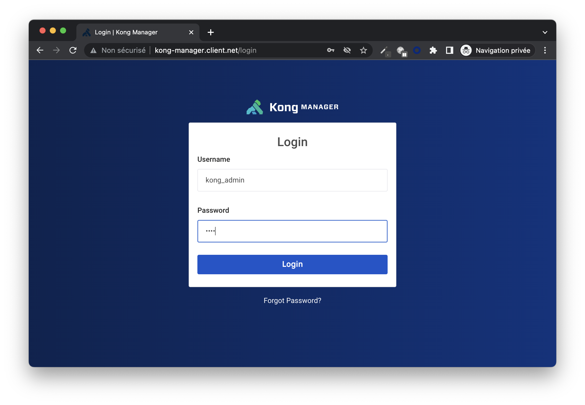
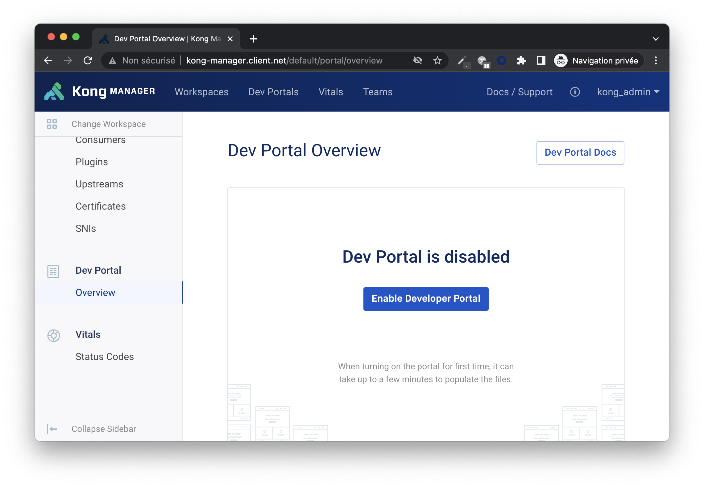
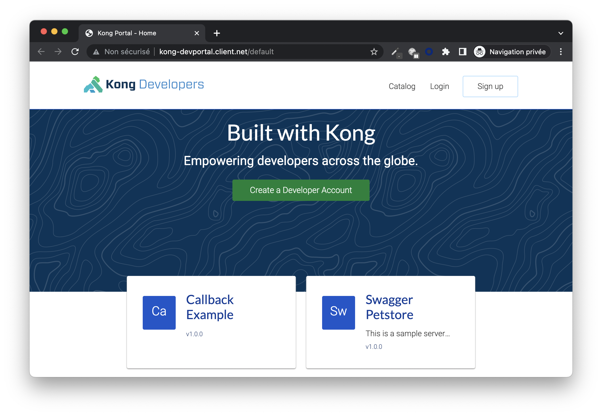

# Install Kong Enterprise in Hybrid mode with kubectl apply

## Information
This repo helps you to install Kong Enterprise in hybrid mode with `kubectl apply` (without Helm).

In this example:
- The Control Plane (CP) and Data Plane (DP) are deployed in the same namespace (called kong). Feel free to change the namespace of CP and DP.
- In hybrid mode, a mutual TLS handshake (mTLS) is used for authentication between DP and CP. The Shared Mode is used in this example. For production, use PKI mode, see: 
https://docs.konghq.com/gateway/latest/production/deployment-topologies/hybrid-mode/setup/
- Adapt the pre-configured URL (in **both** yaml files) to your environment. The URL are for instance http://kong-proxy.client.net or http://kong-manager.client.net

## Prerequisites
- A Kubernetes cluster, v1.19 or later
kubectl v1.19 or later
- (Enterprise only) A license.json file from Kong

## How to install Kong in hybrid mode
1) Create namespace

```
kubectl create namespace kong
```

2) Create license secret

```
kubectl create secret generic kong-enterprise-license --from-file=license -n kong
```

3) Create PostgreSQL

```
kubectl create -f postgres-Full.yaml -n kong
```

Uncomment the ```PersistentVolume kind``` if you are not on GCP

4) Create mutual TLS Certificate for Control Plane - Data Plane

```
openssl req -new -x509 -nodes -newkey ec:<(openssl ecparam -name secp384r1) \
  -keyout /tmp/cluster.key -out /tmp/cluster.crt \
  -days 1095 -subj "/CN=kong_clustering"
```

Create secret with MTLS certificate
```
kubectl create secret tls secret-hybrid-cluster-tls --cert=/tmp/cluster.crt --key=/tmp/cluster.key -n kong
````

5) Deploy Control Plane

```
kubectl create -f kong-cp.yaml -n kong
```

6) Deploy Data Plane

```
kubectl create -f kong-dp.yaml -n kong
```

In case of Data Plane is not deployed on same namespace :
- Uncomment the first part of yaml definition (which concerns ```kind: ServiceAccount```)
- Create secret with mTLS certificate
- Change the namespace

## How to check Kong is correctly installed
1) Check the pods

```
kubectl get pods -n kong
```

The expected result is:
| NAME | READY | STATUS | RESTARTS |
|---|---|---|---|
|kong-cp   |1/1   |Running   | 0  |
|kong-dp   |1/1   |Running   | 0  |
|kong-migration-bootstrap   | 0/1 |Completed   | 0  |
|postgres   |1/1  |Running   | 0  |

2) Check the services
```
kubectl get services -n kong
```

| NAME | TYPE | CLUSTER-IP | EXTERNAL-IP | PORT(S) |
|---|---|---|---|---|
| kong-admin | LoadBalancer | IP-1 | IP-a |80:port-1/TCP,443:port-2/TCP |
| kong-cluster-hybrid | NodePort | IP-2  |none | 8005:port-3/TCP,8006:port-4/TCP |
| kong-devportal | LoadBalancer |IP-3 | IP-b|80:port-5/TCP,443:port-6/TCP |
| kong-devportal-api | LoadBalancer |IP-4 | IP-c| 80:port-7/TCP,443:port-8/TCP|
| kong-manager | LoadBalancer |IP-5 |IP-d |80:port-9/TCP,443:port-10/TCP |
| kong-proxy | LoadBalancer |IP-6 |IP-e | 80:port-11/TCP,443:port-12/TCP |
| kong-proxy-status | LoadBalancer |IP-7 |IP-f |80:port-13/TCP  |
| postgres | NodePort |IP-8 | none|5432:port-14/TCP |

## What are the Kong's URLs
The Kong's URLs are
|Kong Module|HTTP URL|HTTPS URL|
|---|---|---|
|Manager|http://kong-manager.client.net|https://kong-manager.client.net
|Admin API|http://kong-admin.client.net|https://kong-admin.client.net|
|DevPortal|http://kong-devportal.client.net|https://kong-devportal.client.net|
|DevPortal API|http://kong-portal-api.client.net|https://kong-portal-api.client.net|
|Proxy Gateway|http://kong-proxy.client.net|https://kong-proxy.client.net|

## How to access the Kong Manager
Open a browser and go to http://kong-manager.client.net

The username is '''kong_admin''' and the default password is '''kong'''


## How to access the Kong Developer Portal
First, enable the DevPortal by going to Kong Manager, DevPortal / Overview and by clicking on Enable Devportal Portal



Open a browser and go to http://kong-devportal.client.net



## Test Kong with an upstream service

The service used is ```http://mockbin.org```

Create Service
```
curl -i -s -X POST http://kong-admin.client.net/services \
  --data name=example_service \
  --data url='http://mockbin.org'\
  --header 'Kong-Admin-Token: kong'
  ```

Create Route
```
curl -i -X POST http://kong-admin.client.net/services/example_service/routes \
  --data 'paths[]=/mock' \
  --data name=example_route \
  --header 'Kong-Admin-Token: kong'
```

Test the Kong Service
```
curl -X GET http://kong-proxy.client.net/mock/requests
```

## Post installation
Delete the job ```kong-migration-bootstrap``` which bootstraps the database

```
kubectl delete pod kong-migration-<to-be-changed> -n kong
```


## How to uninstall Kong
Remove the kong namespace

```
kubectl delete namespace kong
```